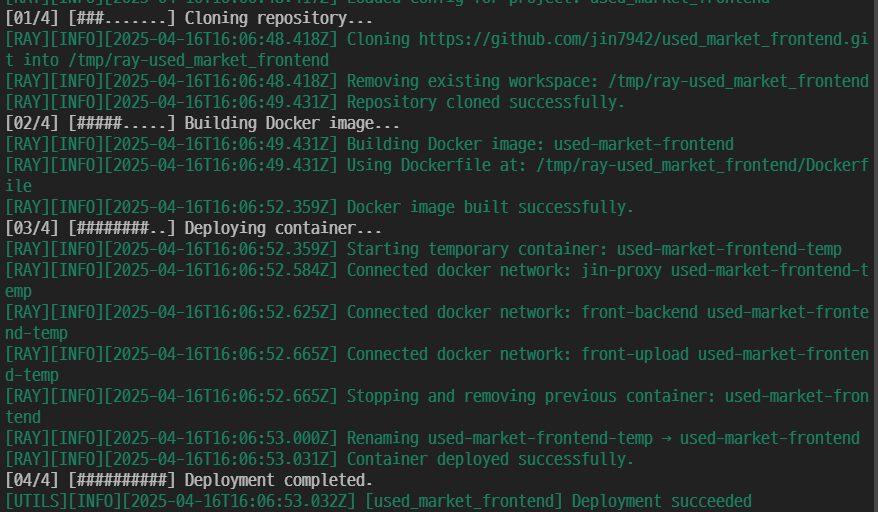

# RAY

[](https://www.npmjs.com/package/@jin7942/ray)
[](https://www.npmjs.com/package/@jin7942/ray)
[](./LICENSE)

**ver: 1.4.5**

[한국어 README 보기](./README.ko.md)



**A lightweight, no-nonsense CI/CD automation tool.**

RAY clones your GitHub repo, runs your build command, builds a Docker image, and replaces containers with zero downtime — all from a simple JSON config. No YAML, no cloud vendor lock-in, just code that ships.

---

## Features

-   Clone GitHub repositories
-   Docker image creation
-   Zero-downtime container replacement
-   JSON-based config file
-   CLI and library usage supported

---

## Installation

```bash
npm install -g @jin7942/ray
```

---

## CLI Usage

```bash
ray init               # Create default config file
ray init wizard        # Run interactive setup wizard
ray run                # Run all configured projects
ray run <project>      # Run a specific project
ray help               # Show help
```

---

## Configuration Example (`ray.config.json`)

```jsonc
{
    "projects": [
        {
            "name": "my-app",
            "repo": "https://github.com/user/my-app.git",
            "branch": "main",
            //"buildCommand": "npm run build",
            // As of v1.2.0, RAY no longer executes buildCommand during deployment.
            // You must define the build process directly inside your Dockerfile.
            "docker": {
                "image": "my-app-image",
                "containername": "my-app-container",
                "path": "./Dockerfile",
                "network": ["net1", "net2"], // Added --network support for Docker containers
                "volumes": ["/host/path:/app/path", "/tmp/test:/app/test"] // Added support for Docker container volume mounts.
            },
            "internal": {
                "logdir": "./logs",
                "maxLogDirSize": 5242880,
                "logLevel": "info",
                "envFilePath": "./.env"
            }
        }
    ]
}
```

## Dockerfile Example (`Dockerfile`)

```docker
FROM node:22-alpine AS builder

WORKDIR /app
COPY . .

RUN apk update && apk upgrade
RUN npm install
RUN npm run build

FROM node:22-alpine

WORKDIR /app

COPY --from=builder /app/dist ./dist
COPY --from=builder /app/package.json .
COPY --from=builder /app/package-lock.json .

RUN apk add --no-cache git

RUN npm install --omit=dev

EXPOSE 7979

CMD ["node", "dist/server.js"]

```

### You must write your build logic inside the Dockerfile. RAY does not run build commands anymore as of v1.2.0.

---

## Library Usage

```ts
import { loadProjectConfig, runRayPipeline } from '@jin7942/ray';

const config = await loadProjectConfig('my-app');
await runRayPipeline(config);
```

### [document](./DOCUMENT.md)

---

## Requirements

-   Node.js 18+
-   Git installed
-   Docker installed and running

---

## Simple Example

Want to see how to use RAY in a real server?

## Check out [RAY Auto Deploy Server](https://github.com/jin7942/ray-auto-deploy-server) — a lightweight webhook server that uses RAY for CI/CD automation.

---

## Philosophy

Ray is a lightweight CI/CD tool designed to let anyone experience automated deployment without complex configuration. It minimizes setup and maximizes usability, making it easy to use even for students or beginner developers with little to no deployment experience.

---

## Release History

| Version | Date       | Description                                                                 |
| ------- | ---------- | --------------------------------------------------------------------------- |
| v1.0.0  | 2025-04-09 | Initial release. Core pipeline features complete                            |
| v1.1.0  | 2025-04-10 | Support for setting environment variables                                   |
| v1.2.0  | 2025-04-11 | Supports external log directory mounting. Build process moved to Dockerfile |
| v1.3.0  | 2025-04-12 | Added --network support for ocker containers. Improved Git clone process    |
| v1.4.0  | 2025-04-12 | Added support for Docker container volume mounts.                           |

---

## License

MIT

---

## Contributing

This project is open source and welcomes contributions, suggestions, and feedback.

-   Open an issue: [GitHub Issues](https://github.com/jin7942/ray/issues)
-   Pull requests are welcome.

## Links

-   GitHub: https://github.com/jin7942/ray
-   Issues: https://github.com/jin7942/ray/issues
